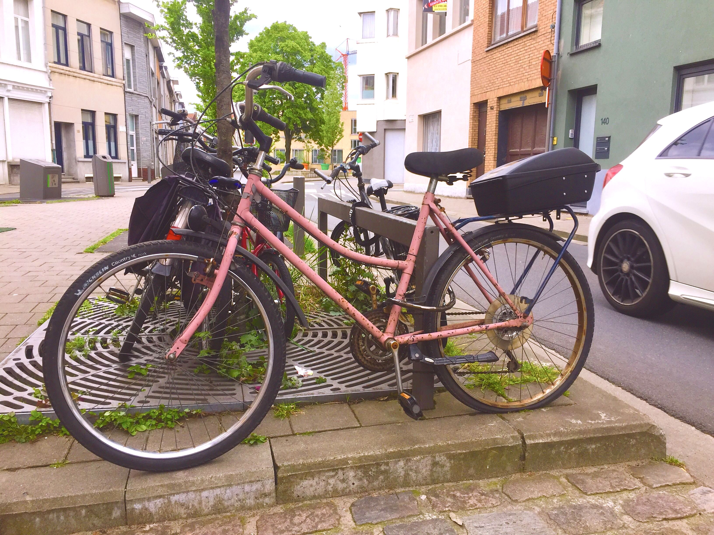
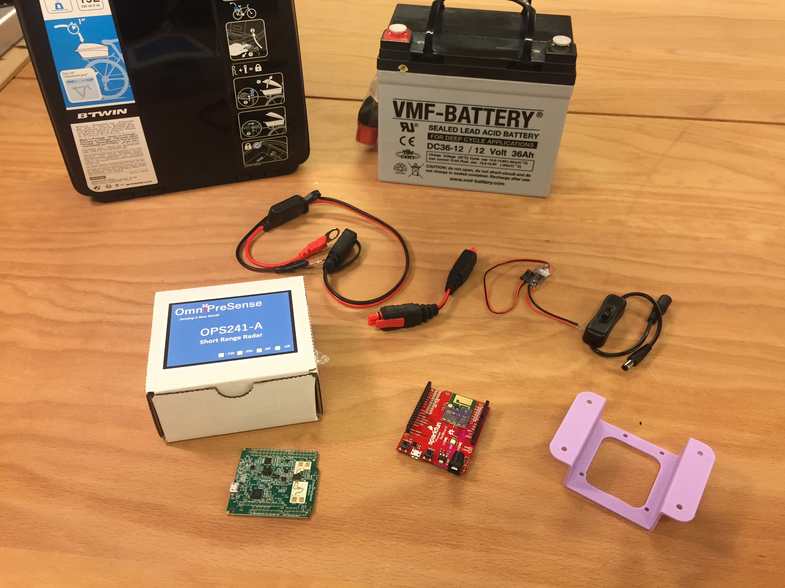
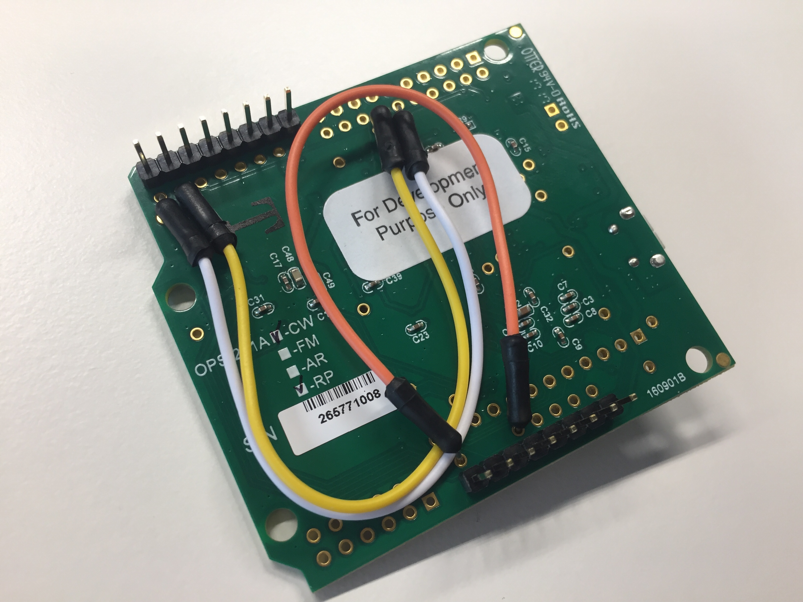
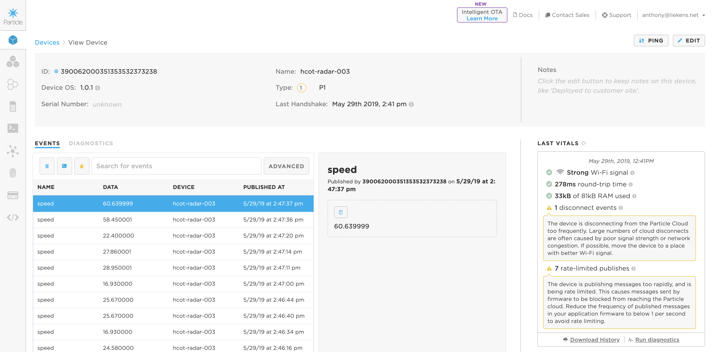

# flitsfiets

Bouw zelf je eigen radar om undercover snelheidsmetingen van voertuigen uit te voeren.

We ontwikkelden bij imec City of Things samen met burgerbeweging 30 MAX! een flitsfiets. Met deze flitsfiets kan de burgerbeweging zelf snelheidsmetingen van de voertuigen in hun buurt uitvoeren. Door objectieve data te verzamelen kunnen ze hun bezorgdheden met meer kracht aan het beleid communiceren. Met deze repository willen we iedereen in staat stellen hun eigen radar te bouwen en samen te werken aan meer respect voor de zone 30.

# Onderdelen

Alle onderdelen (behalve 1 3D print) zijn gemakkelijk off the shelf te verkrijgen. Je kan ze online bestellen en zo je eigen flitsfiets 
bouwen. 

* We gebruiken een radar van Omnipresense. Deze is heel duur (bijna 180€), maar komt met een certificaat dat ie minder dan 1% fout op de metingen maakt (minder dan 1 mijl per uur fout op een meting van 130 mijl per uur). Een goed werkende radar is een vereiste om correcte en objectieve metingen uit te voeren.
* De radar is een shield dat past op een klassieke Arduino. We gebruiken een Photon Redboard van Sparkfun. Dit bord gebruikt een wifi module van particle.io en kan ook Arduino shields ontvangen.
* We voeden de radar met een deep cycle autobatterij. Omdat de radar en wifi samen zo'n 3 watt verbruiken is een 12V 36Ah batterij na 8 dagen volledig opgebruikt.
* We gebruiken een combinatie van (Noco) stekkers om de batterij gemakkelijk los te koppelen van de radaropstelling.
* De radaropstelling gebruikt een kleine buck converter om de 12V van de batterij efficiënt om te zetten naar de 5V die de radaropstelling gebruikt.
* De radar wordt in een topcase bagagedrager bevestigd met een ge-3D-printe beugel, bouten en moeren en een montageband.

| Component | Producent | Leverancier | Prijs |
| ------------- | ------------- | --- | -----: |
| [Topcase voor bagagedrager](https://www.decathlon.be/nl/p/topcase-voor-bagagedrager-fiets-onesecondclip/_/R-p-160375?mc=8396337&c=ZWART) | B'twin | Decathlon | €36.00 |
| [OPS-241A radar](https://www.mouser.be/ProductDetail/203-OPS241ACWRP) | Omnipresense | Mouser |   €178.58 |
| [Photon Redboard](https://www.sparkfun.com/products/13321) | Sparkfun | Sparkfun | €31.36 |
| [2.1mm barrel jack met knop](https://www.mouser.be/ProductDetail/485-1125) | Adafruit | Mouser | €2.46 |
| [12V naar 5V buck converter](https://www.mouser.be/ProductDetail/485-1385) | Adafruit | Mouser | €10.52 |
| [Male to male connector](http://www.accucentrale.com/docs/webshop.asp?act=item&itemcode=GC013) | Noco | ACA | 9.34€ |
| [Eyelet connector](http://www.accucentrale.com/docs/webshop.asp?act=item&itemcode=GC002) | Noco | ACA | €7.34 |
| [Deep cycle batterij](http://www.accucentrale.com/docs/webshop.asp?act=item&itemcode=DC36-12) | VMF | ACA | €98.34 |
| Beugel | 3d print | |
| Fiets(wrak) | | |
| Fietsslot | | |
| Varia ijzerwaren (montageband, bouten, moeren) | | |

# Bouwen

## Radar

We moeten enkele aanpassingen aanbrengen aan de radarmodule en een aantal settings in de radarmodule instellen.

### Radar patchen

We bereiden de radar voor zodat we hem kunnen uitlezen als een hardware serial device, zoals beschreven in de [Application Note van Omnipresense](https://omnipresense.com/wp-content/uploads/2018/11/AN-014-B_UART-and-Arduino-Support.pdf).

* Zet pinheaders op de voedings- en hardware serial pinnen op de omnipresense. Let op, zet geen pinheaders op de MOSI/MISO pinnen omdat deze voor software serial storingeen zullen zorgen tijdens het gebruik.
* Breng 3 jumperwires aan om de TX/RX en voeding van de radar naar de juiste pinnen van de Sparkfun Photon Redboard te patchen.
  * Verbind TP41 met TP26 (TX naar juiste pin brengen)
  * Verbind TP42 met TP25 (RX naar juiste pin brengen)
  * Verbind VIN met 5V0 (omdat de radar 5V nodig heeft)

## Radar instellingen

Gebruik een seriële monitor om de volgende settings van de radar in te stellen zoals in deze [Application Note van Omnipresense](https://omnipresense.com/wp-content/uploads/2018/12/AN-010-H_API_Interface.pdf):
* `UK` om de units van de radar in km/u in te stellen
* `R-` om enkel de wagens die van de radar wegrijden te rapporteren
* `R>15` om enkel snelheden van meer dan 15km/u te rapporteren (er lijkt veel noise te zijn onder 15km/u)
* `SL` om 50000 samples per 
* `A!` om deze settings te bewaren in de radar.

Als uw radar het `A!` commando niet ondersteunt dan moet je de firmware van de radar upgraden naar de recentste firmware volgens deze [Appliation Note van Omnipresense](https://omnipresense.com/wp-content/uploads/2018/11/AN-013-B_OPS241-Code-Update.pdf).

## Software

De eenvoudige firmware van de Particle Photon volgt metingen van de radar op en verstuurt deze naar de Particle cloud.
* Omdat elk voertuig verschillende opeenvolgende metingen geeft, aggregeren we deze om 1 meting per voertuig door te sturen. Omdat we weten dat het bereik van de radar 25m is en omdat we de snelheden van de voorbijrijdende voertuigen weten, kunnen we ook achterhalen of metingen van 1 of meerdere voertuigen komt en deze bij benadering samen te voegen per voertuig. We sturen van zo'n venster aan metingen de hoogste waarde door.
* Je kan instellingen aan de radar doorgeven met de `radarCommand` functie (bijvoorbeeld om vanop afstand de km/u instelling nog aan te passen).
* Je kan de opstelling ook commando's geven met de `reportParameter` functie, bijvoorbeeld om de huidige wifi SSID door te geven met `wifi` parameter of om een event met testmeting (van 13.7km/u) door te geven aan de cloud met de `speed` parameter.

Installatie van de software op de Photon RedBoard:
* Gebruik de [Particle Quick Start](https://docs.particle.io/quickstart/photon/) om de Photon RedBoard aan je Particle account te hangen.
* Flash de Photon met de code om de radar op te volgen en data naar de Particle cloud te pushen

Je kan snelheden van voorbijrijdende voertuigen nu opvolgen via de Particle console:

Deze data kan nu vanuit de Particle cloud doorgestuurd worden naar andere services, zoals bijvoorbeeld via webhooks of door de snelheidsmetingen op te volgeen met een script, bijvoorbeeld door eeen webhook op je events te hangen in de Particle console of door met curl alle speed events van je Particle devices op te volgen:

``
curl -sN "https://api.particle.io/v1/devices/events/speed?access_token=YOUR_PARTICLE_ACCESS_TOKEN" | YOUR_ADAPTER_CODE
``

## Voeding

Gebruik een male connector, de buck converter en de barrel jack met knop om van de 12V batterij naar een 5V voeding te gaan voor de Photon Redboard

## Installatie in de casing

Bevestig de Photon RedBoard en de radar met M3 boutjes en moeren op de ge-3D-printte beugel.

* Positioneer de beugel binnen in de case, zo ver mogelijk naar achter, door 4 M4 gaten te boren en M3 boutjes en moeren te gebruiken voor de bevestiging.
* Installeer de batterij en de voeding in de case.
* We bevestigen de radar met een montageband en M4 boutjees en moeren rond de batterij op de fiets. We maakten hiervoor 2 sleuven onderin de case zodat de batterij en case met de montageband goed bevestigd kan worden op de fiets.
